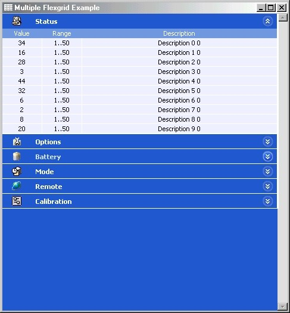



## Multiple Flexgrid XP Stile

### Description

This program is an example on how to handle flexgrid objects to show multiple tables. This saves a lot of space since you can expand the tables you want to see while keeping hidden the others. The interface looks very similar to Win XP.
 
### More Info
 

             |
---                |---
**Submitted On**   |2003-04-10 08:06:12
**By**             |[Lorenzo Nocentini](https://github.com/Planet-Source-Code/PSCIndex/blob/master/ByAuthor/lorenzo-nocentini.md)
**Level**          |Intermediate
**User Rating**    |4.9 (118 globes from 24 users)
**Compatibility**  |VB 6\.0
**Category**       |[Miscellaneous](https://github.com/Planet-Source-Code/PSCIndex/blob/master/ByCategory/miscellaneous__1-1.md)
**World**          |[Visual Basic](https://github.com/Planet-Source-Code/PSCIndex/blob/master/ByWorld/visual-basic.md)
**Archive File**   |[Multiple\_F1572254112003\.zip](https://github.com/Planet-Source-Code/lorenzo-nocentini-multiple-flexgrid-xp-stile__1-44668/archive/master.zip)

